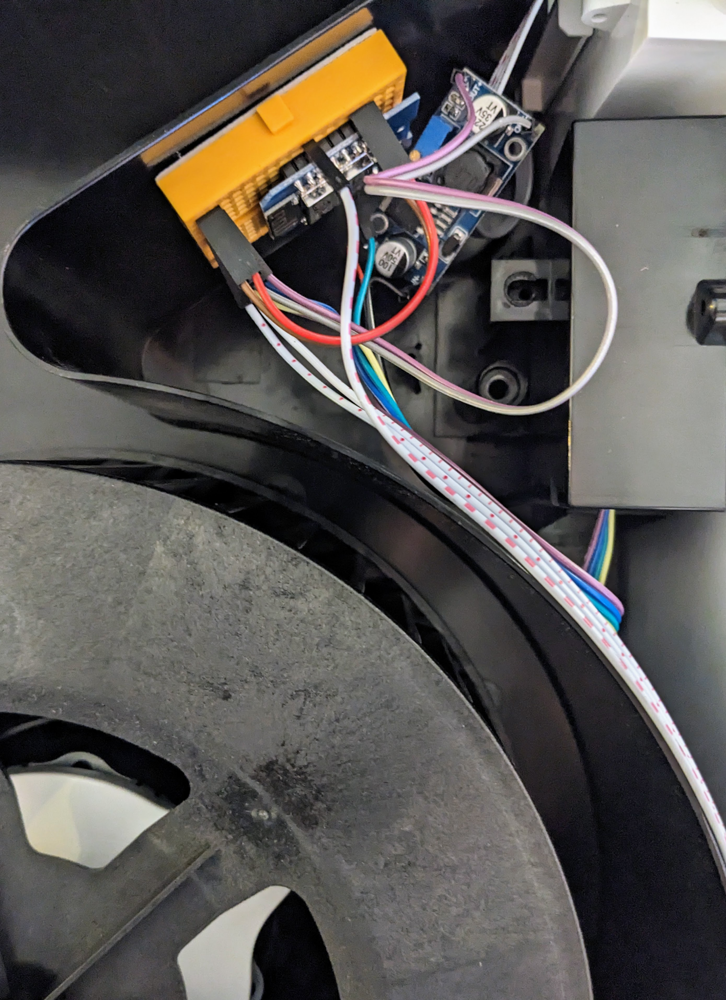
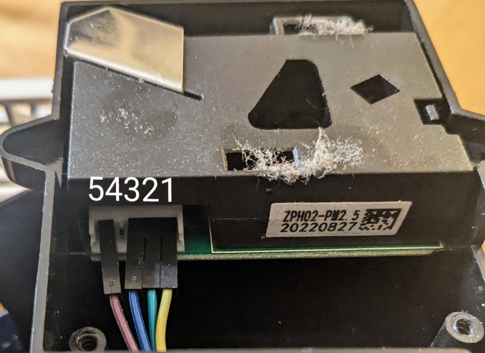

# ESPHome Air Purifier

This project replaces a Levoit LV-PUR131S logic board with an ESP8266 D1 mini and the PM25 sensor (PM1003) with a ZPH02. As new power supply a LM2596 is used - dialed to 5V.

## WARNING: This config is provided for reference only. Use at your own risk!

## Modes

The config provides two modes.
- **auto mode**: Set's the fan speed based on the air quality.
- **manual**: Manual speed control.

At the time of writing ESP has no fan preset mode as expected by Home Assistant (feature request [#1661](https://github.com/esphome/feature-requests/issues/1661)).

## Notes!

**There's likely NO reason you'd want to do this** - unless the logic board or it's power supply failed. After replacement, the unit will have no display or touch control! 

Try to use Levoit's warranty first! Even though Levoit did send me a replacement unit, this was a desperate attempt to not let a good air-purifier go to waste.

You may also want to try to power the logic board from an external source first, before replacing the logic board and PM2.5 sensor.

## ZPH02 Sensor

The ZPH02 Sensor ([datasheet](https://www.winsen-sensor.com/d/files/zph02-particles-and-voc-module-manual-v1_0.pdf)) isn't very sensitive it seems but works well enough for the application. It appears to only recognize major air pollution - like cooking or smoke.

### Wiring

I found the ZPH02 only works when powered from the power supply - not directly from the ESP8266 D1 Mini powered through USB.

- PIN1: Connect this to GND to use the UART mode.
- PIN2: RX pin sending data to the controller.
- PIN3: VCC 5V
- PIN4: Not used in UART mode
- PIN5: GND

The sensor should be cleaned once in a while...

## Installation

There's no guarantee the following will work for you.

- Flash the ESP8266 with the `air_purifier.yaml` config.
- Disassemble the device by unscrewing the bottom screws. Pry open the front panel. 
- Replace the PM2.5 sensor. Or find out how to use the original PM1003 sensor.
- Connect the RX pin of the ZPH02 to the D7 pin of the ESP8266 (D1 Mini).
- Cut the PWM control wires (3 wires) between the motor and logic board and connect the wire with the long stripes to D1 and the middle wire to common ground.
- Connect the ESP8266 to 5V power.
